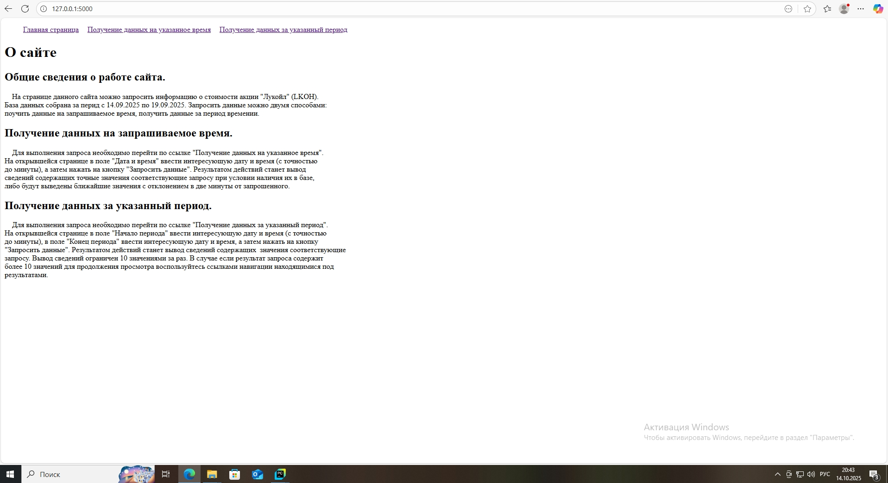
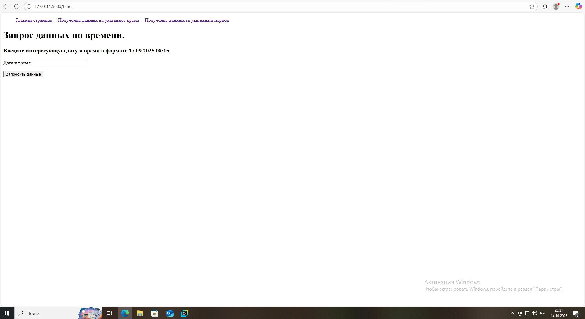
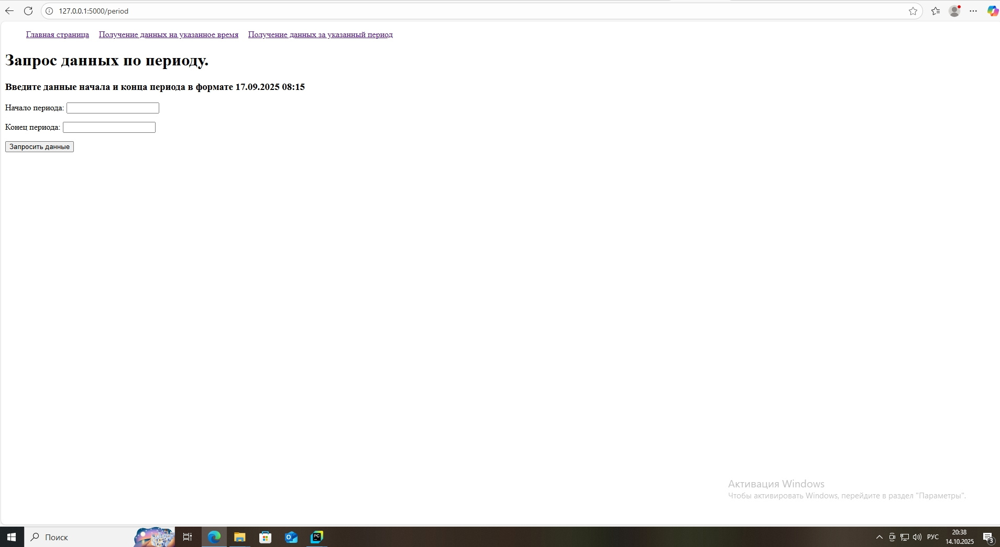
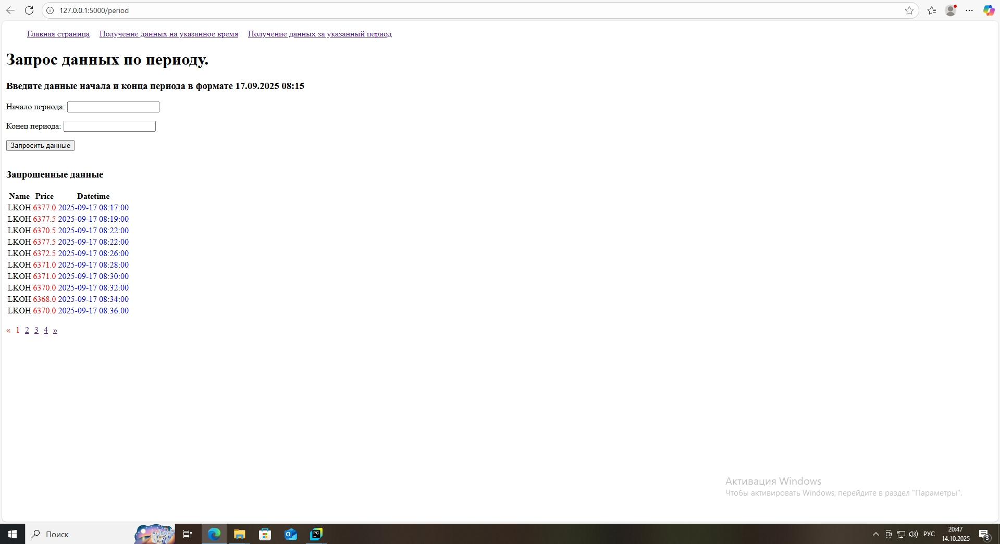

# api_flask

api_flask - эта программа осуществляющая работу веб-сервиса в сети интернет.

# Основной функционал:
1. Создание веб страницы в сети интернет.
2. Обработка и вывод данных в веб браузер.

# Работа api_flask.

1. На странице  сайта можно запросить информацию о стоимости акции "Лукойл" (LKOH).
База данных собрана за перид с 15.09.2025 по 19.09.2025. Запросить данные можно двумя способами:
поучить данные на запрашиваемое время, получить данные за период времении.
2.  Для обработки данных  необходимо запустить файл api_flask из командной строки.
3. Открыть вэб браузер и перейдя по ссылке http://127.0.0.1:5000/ загрузить главную страницу сайта.
 
4. Получение данных на запрашиваемое время.

    Для выполнения запроса необходимо перейти по ссылке "Получение данных на указанное время".
На открывшейся странице в поле "Дата и время" ввести интересующую дату и время (с точностью
до минуты), а затем нажать на кнопку "Запросить данные". Результатом действий станет вывод
сведений содержащих точные значения соответствующие запросу при условии наличия их в базе,
либо будут выведены ближайшие значения с отклонением в две минуты от запрошенного.
5. Получение данных за указанный период.

   Для выполнения запроса необходимо перейти по ссылке "Получение данных за указанный период".
На открывшейся странице в поле "Начало периода" ввести интересующую дату и время (с точностью
до минуты), в поле "Конец периода" ввести интересующую дату и время, а затем нажать на кнопку
"Запросить данные". Результатом действий станет вывод сведений содержащих  значения соответствующие
запросу. Вывод сведений ограничен 10 значениями за раз. В случае если результат запроса содержит
более 10 значений для продолжения просмотра воспользуйтесь ссылками навигации находящимися под
результатами.

 
# Структура проекта.

В проект входят следующие файлы:
1. api_flask - программный интерфейс приложениял.
2. date.csv - в файле находятся архив собранных данных.
3. date_flask- файл принимает запрос и возвращает необходимый DataFrame на основе библиотеки pandas.
4. папка templates- в папке находятся HTML файлы проекта.
5. папка static-в папке находятся  таблицы стилей HTML файлов.
6. .gitignor. 
7. README.md 
8. requirements.txt
9. папка screenshot- хранятся скриншоты для файла README.md

# Дополнительные условия.

1. База данных содержащаяся в файле date.csv располагает данными за период  с 2025-09-15 12:42 по
2025-09-19 23:29.
2. Для конфигурации app.config['SECRET_KEY'] необходимо в корневом каталоге проекта создать файл .env
с переменной SECRET_KEY (например SECRET_KEY='gdgas43gdfgfgs46hfg6hf7gh9f').
